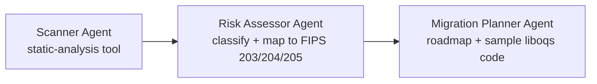

# Agentic PQC Migration Advisor

> **Status:** v0.1-foundations. This release contains the ML-KEM (FIPS 203)
> key-exchange groundwork. The agent pipeline below is planned, not yet built.

## The problem
Organisations face hard post-quantum migration deadlines. US federal systems
must migrate key establishment by 2030 and signatures by 2031. The UK NCSC
roadmap sets planning by 2028, high-priority upgrades by 2031, and full
migration by 2035. Most teams don't know where classical cryptography lives
in their codebases, or which usages to fix first.

This tool will scan a codebase, flag classical crypto usage, and produce a
risk-ranked migration roadmap mapped to NIST's PQC standards.

## Planned architecture


| Agent | Role | Output |
|---|---|---|
| Scanner | Runs Python `ast` over the target repo. The LLM does not parse the code itself. | Findings with file/line, stored in SQLite |
| Risk Assessor | RSA/ECC → critical (Shor's algorithm); symmetric → lower priority (Grover's algorithm) | Risk-ranked findings mapped to ML-KEM / ML-DSA / SLH-DSA |
| Migration Planner | Sequences the fixes and drafts liboqs replacement snippets | Prioritised roadmap |

The orchestration is hand-rolled, without an agent framework. It uses a local
LLM through Ollama, so no API keys leave the machine.

## What's in this release
- `handshake.py`: the algorithm is set by the ALGORITHM constant (currently ML-KEM-768, tests adapt accordingly) KeyGen → Encaps → Decaps using liboqs-python.
- `client.py`/`server.py`: Handshake split over TCP sockets. The client
  generates the keypair and the server encapsulates, mirroring how TLS 1.3
  hybrid key exchange (X25519MLKEM768) carries the public key in the
  ClientHello and returns the ciphertext in the ServerHello.
- `test/test_handshake.py`: test/test_shared_secret_matches, test/test_implicit_rejection, test/test_public_key_size, test/test_private_key_size, test/test_shared_secret_size, test/test_ciphertext_size, test/test_diff_handshakes_give_diff_secrets, test/test_ciphertext_error, test/test_public_key_error, test/test_keypairs_are_ephemeral
- `test/test_framing.py`: test/test_round_trip, test/test_realistic_size, test/test_message_boundaries, test/test_fragmented_delivery, test/test_peer_closes_mid_message, test/test_oversized_header, test/test_empty_payload.
- `test/test_socket_handshake.py`: integration tests. test/test_secrets_match check client and server get the same key of the correct length. test/test_server_rejects_wrong_size_public_key, test/test_client_fails_when_no_server_listening, test/test_server_timeout_on_silent_client.

## Quick start
Requires Python >=3.10 and
[uv](https://docs.astral.sh/uv/). On macOS, liboqs needs `brew install cmake ninja`.

    git clone https://github.com/JacobProwse/Agentic-Migration-Adviser.git
    cd Agentic-Migration-Adviser
    uv sync
    uv run python server.py & sleep 1 && uv run python client.py
    uv run pytest -q

## Example output

```text

Server listening on ('127.0.0.1', 65432)
Connected to server at 127.0.0.1:65432
Connection from: ('127.0.0.1', 63012)
Server hashed shared secret snippet: ba1a49dc2b7b70bc...
Client hashed shared secret snippet: ba1a49dc2b7b70bc...
21 passed in 0.54s

```

For reference, FIPS 203 specifies these ML-KEM-768 (current set algorithm) sizes: public key 1184 B,
ciphertext 1088 B, shared secret 32 B.

## Design decisions
- **pyproject.toml + uv** over requirements.txt, for a lock file and reproducible installs.
- **Sockets rather than an in-process split:** I chose to prioritise learning value (framing, blocking I/O, connection lifecycle) over ~4 hrs extra cost. Bonus: Potential reuse in project 2.
- **Client generates the keypair, server encapsulates:** this matches the real TLS 1.3 hybrid flow (however I only used ML-KEM not hybrid).

## What I learned
- Where a rule should live matters as much as the rule itself. I initially considered enforcing the exact public key size in the framing layer. Instead, the framing layer checks against a generic 1 MiB cap, on both send and receive, whilst the handshake layer checks the exact public key. The revision came from the principle that lower layers should provide mechanism, whilst higher layers decide policy. The principle ensures that the behaviour of lower layers is independent of the process which sits above it. If the algorithm changes in later development the framing module doesn't need adjusting.
- A test that can't fail gives false confidence. I thought running two handshakes and asserting their secrets differ would ensure that each client generates a fresh keypair. Then, I realised that the test would have passed even if the client reused its keypair, because encaps adds its own randomness. Instead, I produced a unit test that directly compares the public keys of two Client instances. Now, before trusting a test, I make sure to try at least one mutation check to make sure that a test really can fail; using git restore to make sure the deliberate break never gets committed.
- The liboqs library handles the maths, not the protocol. It made generating keys & ciphertexts easy for running a basic procedural program. However, I had to provide the framework by splitting protocol roles between the client/server sockets, verifying implicit rejection of a tampered ciphertext (since decaps returns a wrong secret with no exception) and more.

## Limitations & roadmap
- This is a key-exchange demo, not TLS. The handshake is unauthenticated,
  and a real deployment would need signatures such as ML-DSA.
- [ ] Scanner Agent + SQLite findings store
- [ ] Risk Assessor Agent
- [ ] Migration Planner Agent + orchestrator
- [ ] GitHub Actions CI (pytest + ruff)
- [ ] Dockerfile for one-command setup
- [ ] Support for codebases beyond Python

## Tech stack
Used: python, liboqs-python (Open Quantum Safe), NIST ML-KEM, uv.
Planned: SQLite, Ollama, GitHub Actions, Docker.
